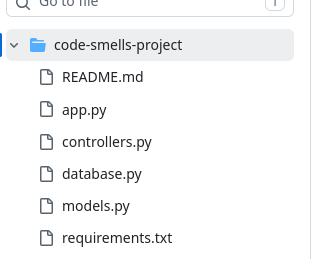
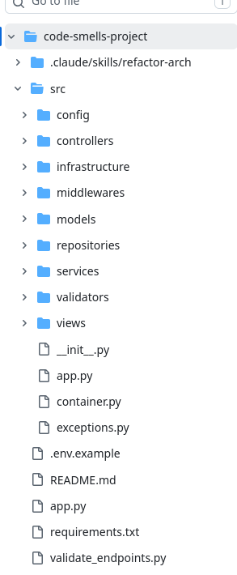
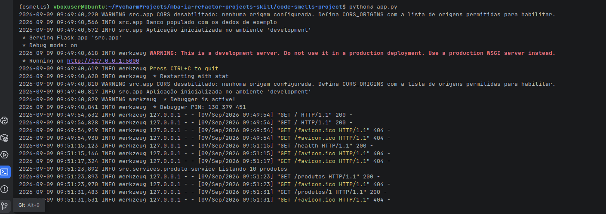
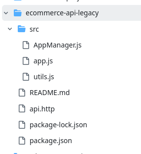
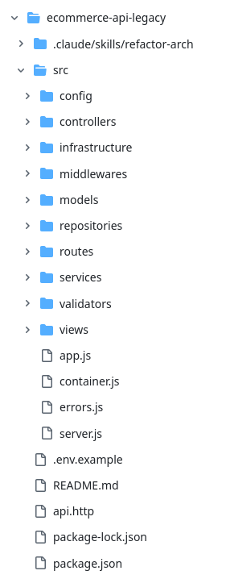
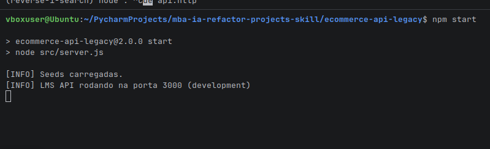
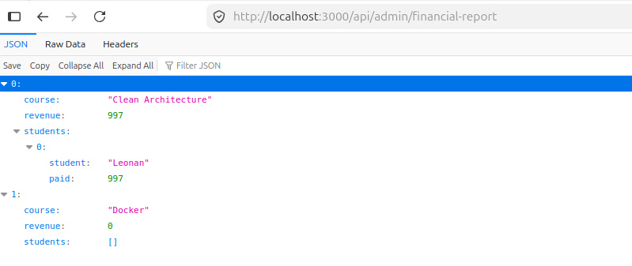
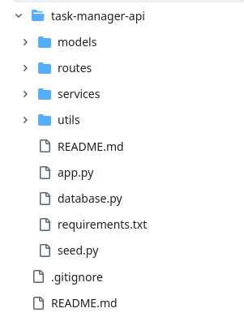
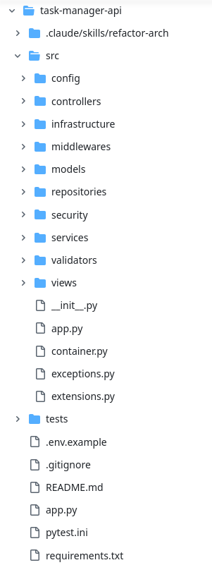
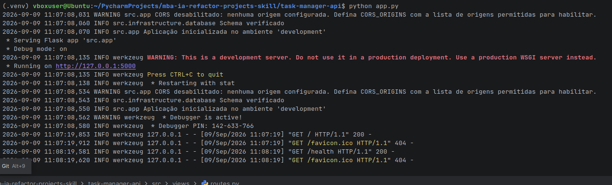

## Análise Manual dos Projetos
- `code-smells-project/` (Python/Flask — API de E-commerce)
  - CRITICAL
    - Alto risco de SQL injection por aceitar comando SQL sem validacao
  - HIGH
    - Acesso ao banco de dados diretamente na controller
    - Sem estrutura básica de camadas
  - MEDIUM
    - Sem padrão nas rotas
    - Problema de Queries N+1
  - LOW
    - Muitos "magic numbers" soltos
    - Use excessivo de Ifs que deixa o código difícil de ler
- `ecommerce-api-legacy/` (Node.js/Express — LMS API com fluxo de checkout)
  - CRITICAL
    - Credenciais expostas
    - "GOD" class
  - HIGH 
    - Acesso ao banco de dados diretamente da controller
    - Sem separação minima de camadas
  - MEDIUM
    - Callback Hell
    - Alta complexidade ciclomatica
  - LOW
    - Variáveis com nomes ruins
    - Use excessivo de Ifs que deixa o código difícil de ler
  `task-manager-api/` (Python/Flask — API de Task Manager)
    - CRITICAL
      - Credenciais expostas
      - Expõe informações sensíveis do usuário como a senha
    - HIGH
      - Acesso ao banco de dados diretamente na controller
      - Separação ruim das camadas
    - MEDIUM
      - Alta complexidade ciclomatica
      - Funções muito grandes
    - LOW
      - Use excessivo de Ifs que deixa o código difícil de ler
      - "magic numbers" soltos

## Construção da Skill
A construção da skill foi desenha para seguir as etapas definidas, com objetivos, formato de saída e critérios de aceite.

### Anti-patterns 
- Security Vulnerability
  - SQL Injection
  - Exposed credentials
  - Sensitive data exposure
- Controller with direct database access
- Poor or missing layer separation
- N+1 Query
- High Cyclomatic Complexity / Callback Hell
- Long Function
- Readability Smells
  - Magic numbers
  - Poor naming
  - Excessive sequential conditionals

Foram escolhidos com base nos achados nos projetos do desafio, e também por serem comuns em muitos projetos que já trabalhei.

Para a skill ser agnostica não foi indicado nada sobre linguagens, 
mas sim indicado para ela usar as informações encontradas na análise

### Resultados

### code smell project
```
================================
ARCHITECTURE AUDIT REPORT
================================
Project: code-smells-project
Stack:   Python 3.13 + Flask 3.1.1 + SQLite (raw SQL)
Files:   4 analyzed | ~780 lines of code
Date:    2026-09-02
================================
```

#### Summary

| Severity | Count |
| --- | --- |
| CRITICAL | 8 |
| HIGH | 7 |
| MEDIUM | 9 |
| LOW | 7 |
| **Total** | **31** |

#### Estrutura anterior:


#### Estrutura atual:


#### Checklist de Validação

#### Fase 1 — Análise
- [x] Linguagem detetada corretamente
- [x] Framework detetado corretamente
- [x] Domínio da aplicação descrito corretamente
- [x] Número de arquivos analisados condiz com a realidade

#### Fase 2 — Auditoria
- [x] Relatório segue o template definido nos arquivos de referência
- [x] Cada finding tem arquivo e linhas exatos
- [x] Findings ordenados por severidade (CRITICAL → LOW)
- [x] Mínimo de 5 findings identificados
- [x] Deteção de APIs deprecated incluída (se aplicável)
- [x] Skill pausa e pede confirmação antes da Fase 3

#### Fase 3 — Refatoração
- [x] Estrutura de diretórios segue padrão MVC
- [x] Configuração extraída para módulo de config (sem hardcoded)
- [x] Models criados para abstrair dados
- [x] Views/Routes separadas para visualização ou roteamento
- [x] Controllers concentram o fluxo da aplicação
- [x] Error handling centralizado
- [x] Entry point claro
- [x] Aplicação inicia sem erros
- [x] Endpoints originais respondem corretamente
#### App em execução


### ecommerce api legacy
```
================================
ARCHITECTURE AUDIT REPORT
================================
Project: ecommerce-api-legacy
Stack:   JavaScript (Node.js, CommonJS) + Express 4.18.2 + sqlite3 5.1.6
Files:   3 analyzed | ~180 lines of code
Domain:  LMS / plataforma de cursos com fluxo de checkout
         (users, courses, enrollments, payments, audit_logs)
================================

```

Summary
CRITICAL: 5 | HIGH: 5 | MEDIUM: 5 | LOW: 6

#### Estrutura anterior:


#### Estrutura atual:

#### Checklist de Validação

#### Fase 1 — Análise
- [x] Linguagem detetada corretamente
- [x] Framework detetado corretamente
- [x] Domínio da aplicação descrito corretamente
- [x] Número de arquivos analisados condiz com a realidade

#### Fase 2 — Auditoria
- [x] Relatório segue o template definido nos arquivos de referência
- [x] Cada finding tem arquivo e linhas exatos
- [x] Findings ordenados por severidade (CRITICAL → LOW)
- [x] Mínimo de 5 findings identificados
- [x] Deteção de APIs deprecated incluída (se aplicável)
- [x] Skill pausa e pede confirmação antes da Fase 3

#### Fase 3 — Refatoração
- [x] Estrutura de diretórios segue padrão MVC
- [x] Configuração extraída para módulo de config (sem hardcoded)
- [x] Models criados para abstrair dados
- [x] Views/Routes separadas para visualização ou roteamento
- [x] Controllers concentram o fluxo da aplicação
- [x] Error handling centralizado
- [x] Entry point claro
- [x] Aplicação inicia sem erros
- [x] Endpoints originais respondem corretamente
#### App em execução



### task manager api

```
================================
ARCHITECTURE AUDIT REPORT
================================
Project: task-manager-api
Stack:   Python 3.13 + Flask 3.0.0 + Flask-SQLAlchemy 3.1.1 + SQLite
Files:   12 analyzed | 1.158 lines of code
Date:    2026-09-02
================================
```
#### Summary

**CRITICAL: 7 | HIGH: 7 | MEDIUM: 16 | LOW: 12 — Total: 42 findings**

#### Estrutura anterior:


#### Estrutura atual:

#### Checklist de Validação
#### Fase 1 — Análise
- [x] Linguagem detetada corretamente
- [x] Framework detetado corretamente
- [x] Domínio da aplicação descrito corretamente
- [x] Número de arquivos analisados condiz com a realidade

#### Fase 2 — Auditoria
- [x] Relatório segue o template definido nos arquivos de referência
- [x] Cada finding tem arquivo e linhas exatos
- [x] Findings ordenados por severidade (CRITICAL → LOW)
- [x] Mínimo de 5 findings identificados
- [x] Deteção de APIs deprecated incluída (se aplicável)
- [x] Skill pausa e pede confirmação antes da Fase 3

#### Fase 3 — Refatoração
- [x] Estrutura de diretórios segue padrão MVC
- [x] Configuração extraída para módulo de config (sem hardcoded)
- [x] Models criados para abstrair dados
- [x] Views/Routes separadas para visualização ou roteamento
- [x] Controllers concentram o fluxo da aplicação
- [x] Error handling centralizado
- [x] Entry point claro
- [x] Aplicação inicia sem erros
- [x] Endpoints originais respondem corretamente

#### App em execução


## Como executar
Ferramenta usada para rodar foi o claude code

### Instalação linux
`curl -fsSL https://claude.ai/install.sh | bash`
### Instalação Windows PowerShell
`irm https://claude.ai/install.ps1 | iex`

Para rodar a skill entre no diretório de qualquer projeto e execute:
`claude "/refactor-arch"`

Para validar a Refatoração precisa checar se foi aplicado a 
estrutura em MVC, criação do report e executar a app.
